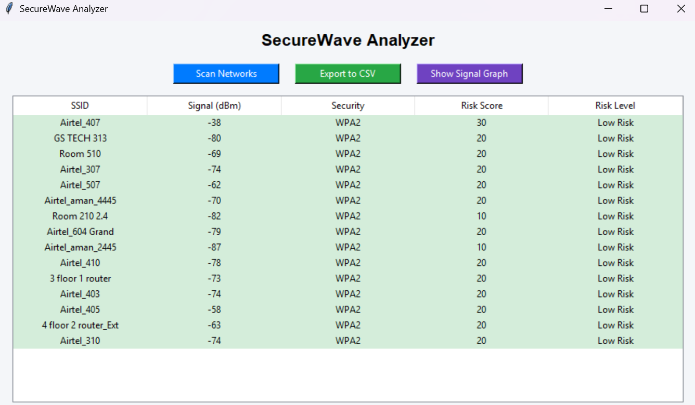
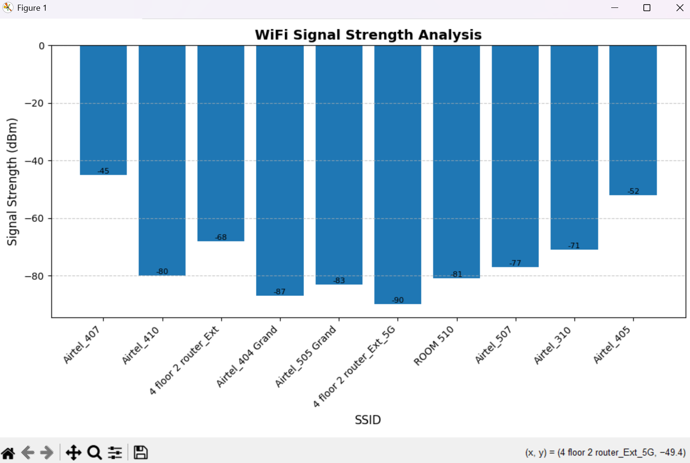

# SecureWave Analyzer


SecureWave Analyzer is a Python-based WiFi security analysis tool that scans nearby wireless networks, evaluates their security posture, and presents results through both a Command Line Interface (CLI) and a Graphical User Interface (GUI).

It combines network scanning, encryption detection, risk scoring, data visualization, and report export into a structured and easy-to-use system.

## 📸 Screenshots

### GUI Interface


### Signal Strength Graph


---

## Features

* WiFi network scanning
* Encryption detection (Open, WPA, WPA2, WPA3)
* Risk scoring engine
* Risk-based sorting
* Colored CLI output
* GUI interface using Tkinter
* Risk-based row highlighting
* Signal strength visualization (Matplotlib)
* CSV report export
* Modular architecture

---

## Technology Stack

* Python
* Tkinter
* PyWiFi
* Matplotlib
* Tabulate
* Colorama
* CSV module

---

## Project Structure

```
securewave-analyzer/
├── main.py
├── gui.py
├── scanner.py
├── risk_engine.py
├── report_generator.py
├── requirements.txt
└── README.md
```

---

## Installation

### 1. Clone the Repository

```
git clone https://github.com/srishtig0711/securewave-analyzer.git
cd securewave-analyzer
```

### 2. Create Virtual Environment

```
python -m venv venv
```

### 3. Activate Virtual Environment

PowerShell:

```
venv\Scripts\Activate.ps1
```

Command Prompt:

```
venv\Scripts\activate
```

### 4. Install Dependencies

```
pip install -r requirements.txt
```

---

## Running the Application

### CLI Mode

```
python main.py
```

This will:

* Scan networks
* Display results in table format
* Provide risk recommendations
* Export CSV report

---

### GUI Mode

```
python gui.py
```

The GUI allows you to:

* Scan networks
* View risk-colored table
* Display signal strength graph
* Export results to CSV

---

## Risk Scoring Logic

The analyzer assigns risk based on:

* Encryption type (Open networks have higher risk)
* Signal strength proximity
* Security classification

Risk levels:

* High Risk
* Medium Risk
* Low Risk

---

## Output

* CLI table view
* GUI table view
* Signal strength bar graph
* CSV file: `securewave_report.csv`

---

## Future Enhancements

* Channel detection
* Real-time refresh mode
* Executable packaging
* UI refinement

---

## Author

Srishti Gupta
GitHub: [https://github.com/srishtig0711](https://github.com/srishtig0711)

---

## License

MIT License

---
